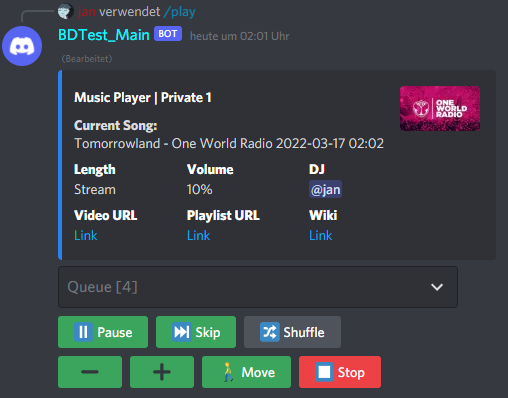

# VoDiPy - Voice Discord Python - Music Bot
This is a discord music bot with a per-guild queue system, optimized specifically for YouTube playlists.  
For non-youtube sources (f.e. soundcloud playlists) it will take longer to load.  
It is using the [Naff](https://github.com/NAFTeam/NAFF) library.

### Dependencies:
- [Python](https://www.python.org/downloads/) Version >= 3.10
- [Naff](https://github.com/NAFTeam/NAFF)
  - `pip install git+https://github.com/NAFTeam/NAFF.git@dev#egg=naff[voice]`
  - at a later point it can be installed with `pip install naff[voice]` 
- Pip packages: `yt-dlp` (or `youtube_dl`); `aiohttp`

### How to run:
- download this project or run `git clone https://github.com/deadkex/VoDiPy`
- install all dependencies
- go [here](https://console.cloud.google.com/apis/library/youtube.googleapis.com) and enable the youtube data api
- create a youtube api token [here](https://console.cloud.google.com/apis/credentials)
- put your bot token and your youtube api token into [VoDiPy_secrets.py](https://github.com/deadkex/VoDiPy/blob/main/vodipy/VoDiPy_secrets.py)
  - the 'message content intent' has to be enabled for the message command
  - otherwise enable global syncing / guild syncing in the config for the slash command
- setup your config in [VoDiPy_defines.py](https://github.com/deadkex/VoDiPy/blob/main/vodipy/VoDiPy_defines.py)
  - change `player_keywords` for easier playlist/video playing
  - adjust `MusicPlayerSettings` according to your needs
- run VoDiPy.py
- `/play link`, `/play keyword` or `<play link`, `<play keyword`

### I want x to be fixed / added
Simply create an issue [here](https://github.com/deadkex/VoDiPy/issues/new) :)